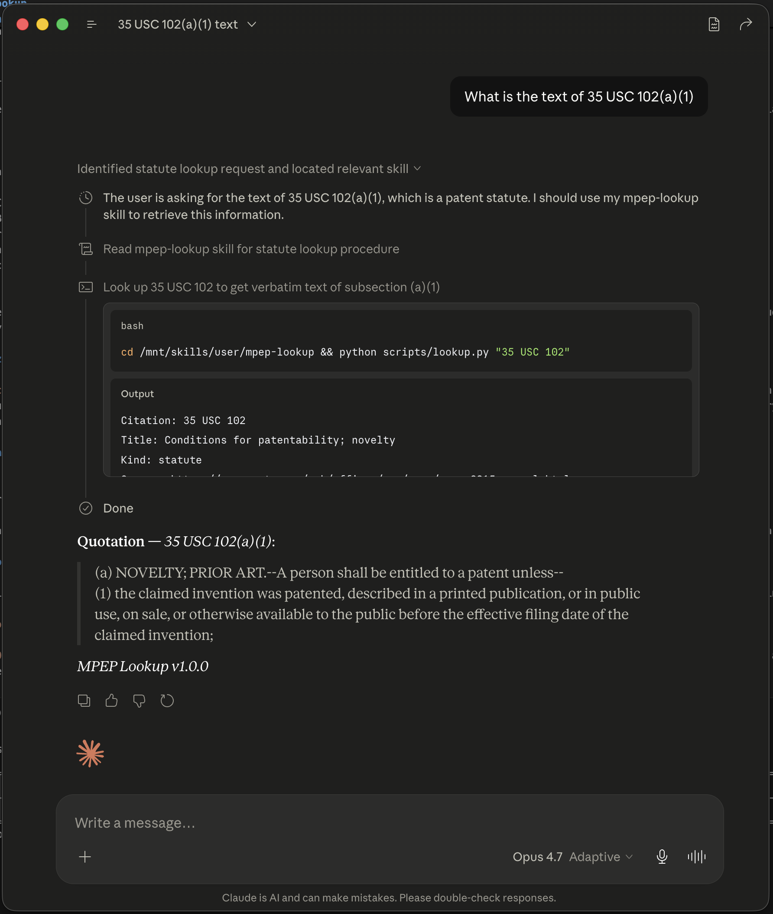

# mpep-lookup

**Verbatim patent-authority retrieval for Claude.** Ask Claude a patent
prosecution question and get back the *actual text* of the MPEP, the patent
statutes, and the patent rules -- quoted word-for-word with pin cites --
instead of a paraphrase that might be subtly (or badly) wrong.

**Nothing leaves your Claude environment.** The skill is self-contained: a
bundled SQLite database queried by local scripts that run inside Claude's own
sandbox. There are no network calls and no external server to contact -- unlike
an MCP server, where the model reaches out to a separate service to answer your
query. The lookup happens entirely within the LLM environment it already runs in.

> **What this is not:** a chatbot that "knows patent law." It is a retrieval
> tool. Every quoted passage comes from a local copy of the official USPTO
> text, and Claude is instructed to verify each quotation against that source
> before answering. Any commentary Claude adds is explicitly labeled so you
> can tell the law from the analysis at a glance.



## Why it matters

General-purpose models paraphrase statutes and MPEP sections from memory.
For patent prosecution that is a liability: a reworded claim-rejection
standard or a half-remembered rule subsection is worse than useless in an
Office Action response. `mpep-lookup` is built around one non-negotiable
property -- **verbatim discipline**:

- **Quotes, not paraphrases.** Answers are grounded in the exact text, with
  pin cites you can drop straight into a response or a memo.
- **Law vs. commentary is always labeled.** Verbatim authority is quoted;
  any summary, IRAC analysis, or application-to-facts that Claude generates
  is marked as such. You are never left guessing which is which.
- **Coverage that matches a real docket.** MPEP sections, 35 U.S.C. statutes
  (MPEP Appendix L), 37 C.F.R. rules (MPEP Appendix R), and USPTO Form
  Paragraphs -- with **both AIA and pre-AIA** versions indexed, because mixed
  dockets need both.
- **No embeddings, no vector search.** Plain SQLite full-text search. There
  is no semantic layer that could quietly substitute a "close enough"
  passage for the one you asked for.

## Install

The fastest path for either target is the prebuilt `mpep-lookup.skill`
bundle -- it already contains the corpus database:

**[Download the latest `mpep-lookup.skill`](../../releases/latest/download/mpep-lookup.skill)** (or browse [all releases](../../releases)).

### Claude.ai (web/desktop)

1. [Download the latest `mpep-lookup.skill`](../../releases/latest/download/mpep-lookup.skill).
2. In Claude.ai, open the skills UI and upload the `.skill` bundle.
3. Ask a patent question. The skill triggers automatically.

### Claude Code (CLI)

1. [Download the latest `mpep-lookup.skill`](../../releases/latest/download/mpep-lookup.skill).
2. Unzip it into your skills directory:
   ```sh
   mkdir -p ~/.claude/skills/mpep-lookup
   unzip mpep-lookup.skill -d ~/.claude/skills/mpep-lookup
   ```
3. Start Claude Code in any project and ask a patent question.

### From source (for rebuilding / contributing)

A plain `git clone` does **not** include the corpus database -- it is
generated by the build pipeline and is intentionally not tracked. To build
it yourself:

```sh
git clone https://github.com/rtmpat/mpep-lookup
cd mpep-lookup
python -m venv .venv && .venv/bin/pip install -r requirements.txt
.venv/bin/python build/01_fetch_corpus.py      # fetch USPTO HTML (~5 min)
.venv/bin/python build/02_parse_to_markdown.py
.venv/bin/python build/03_build_database.py    # -> skill/data/mpep.db
ln -s "$(pwd)/skill" ~/.claude/skills/mpep-lookup
```

## Examples

**Look up a rule by citation.**

> *"What are the timing requirements for filing an IDS in 37 CFR 1.97?"*

Claude returns the verbatim text of 37 C.F.R. 1.97, with the subsections that
govern the timing requirements quoted and pin-cited, plus a clearly labeled
plain-language summary of what they require.

**Find the controlling authority on a topic.**

> *"What does the MPEP say about a prima facie case of obviousness?"*

Claude retrieves MPEP 2142-2143 and 35 U.S.C. 103 verbatim, rather than
reciting a remembered version of the KSR rationales.

**Apply authority to a fact pattern.**

> *"The claims were rejected as anticipated, but the reference doesn't
> disclose one limitation. What's my argument?"*

Claude quotes the anticipation standard verbatim (every element, arranged as
in the claim), then provides a labeled analysis you can adapt -- with the
quoted standard sitting right above the argument so the support is visible.

## How it works

The build pipeline scrapes the official USPTO HTML, converts it to
ASCII-safe text, and loads it into a single SQLite database with an FTS5
full-text index. At runtime the skill answers citation lookups and keyword
searches directly against that local database -- no network call, no model
in the retrieval loop. The load-bearing piece is `SKILL.md`'s **Verification
Pass**, which instructs Claude to check every quoted passage against the
database record *before* composing its answer. That is what enforces the
verbatim discipline; see [`ARCHITECTURE.md`](ARCHITECTURE.md) for the full
design.

## Coverage and limitations

- **Source:** USPTO MPEP, Ninth Edition, **Revision 01.2024** (the revision
  current at build time; check the bundle's `metadata.source_revision` for
  the exact value).
- **Included:** MPEP sections and subsections, 35 U.S.C. (Appendix L), 37
  C.F.R. (Appendix R), Form Paragraphs, and the Subject Matter Index (topic
  routing via `index_lookup.py`) -- AIA and pre-AIA both indexed.
- **Not included:** other appendices (II List of Decisions, T PCT, AI America
  Invents Act, P Paris Convention); supplementary "Updates Since Current
  MPEP" notices. (MPEP Appendix I itself is [Reserved] -- empty -- at USPTO;
  the Subject Matter Index is published as a separate set of pages.)
- **Locked to one revision per build.** When USPTO publishes a new revision,
  rebuild (or grab a newer release).
- **Not legal advice.** This is a retrieval aid. Always confirm against the
  current official text at [mpep.uspto.gov](https://mpep.uspto.gov).

## Rebuilding for a new MPEP revision

USPTO publishes new MPEP revisions periodically. To produce an updated
bundle, run the build pipeline in [`build/`](build/) (see the "From source"
steps above, then `build/04_verify_corpus.py` and
`build/05_package_skill.py`). The build records which revision it captured in
the database `metadata`.

### Releasing (maintainers)

Releases are built by CI. Bump the version in `skill/SKILL.md` (frontmatter
`version` + the printed footer) and add a matching `## vX.Y.Z` section to
`CHANGELOG.md`, then push a tag:

```sh
git tag v1.0.0 && git push origin v1.0.0
```

`.github/workflows/release.yml` then rebuilds the corpus from USPTO, runs the
tests, packages `mpep-lookup.skill`, and publishes a GitHub release with the
bundle attached (asset named with the skill version and MPEP revision, notes
taken from `CHANGELOG.md`). The tag must match the SKILL.md version or the
workflow fails fast.

## License

- **Code** (build pipeline, runtime scripts, tests, docs): Apache License
  2.0 -- see [`LICENSE`](LICENSE).
- **Corpus text** (MPEP, 35 USC, 37 CFR, Form Paragraphs): U.S. Government
  work, public domain under 17 U.S.C. 105 -- see
  [`CORPUS_LICENSE.md`](CORPUS_LICENSE.md) for provenance and the
  build-time-fetch design.

Not affiliated with, endorsed by, or sponsored by the USPTO.

## Contributing

Issues and pull requests welcome. The citation parser is the most fragile,
most-tested component -- 46 of the 67 tests cover it -- so run `pytest` after any change to
`skill/scripts/_common.py`. Non-obvious USPTO HTML quirks discovered during
the build are recorded in [`docs/dev-history/LESSONS.md`](docs/dev-history/LESSONS.md).
